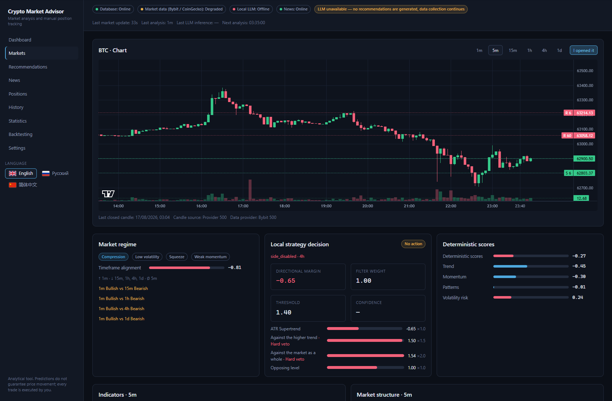
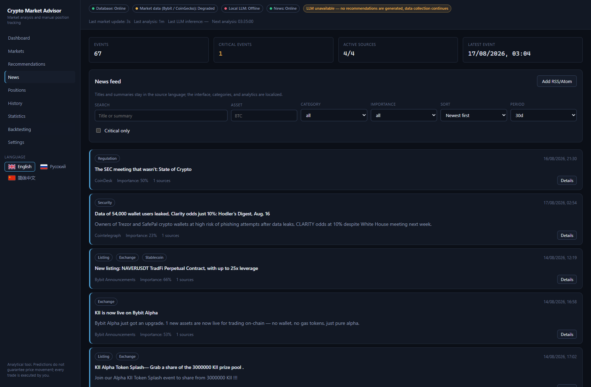

<div align="center">

# Crypto Market Advisor

**A local, self-hosted market analyst for crypto perpetuals — not a trading bot.**

It reads the market, computes the indicators itself, asks a local LLM to interpret them,
puts every answer through a deterministic risk engine, and hands you an advisory.
You place the trade. It keeps the books and grades its own past calls.

[](LICENSE)
[](https://go.dev)
[](https://react.dev)
[](https://www.postgresql.org)
[](#privacy-and-safety)

**English** · [Русский](README.ru.md) · [简体中文](README.zh-CN.md)

</div>

---

## What it does

```
market data + public news  →  local normalisation and dedup
        ↓
indicators · candlestick and chart patterns · market structure · S/R · divergences · regimes
        ↓
historical context: track record, similar past cases
        ↓
compact feature snapshot  →  local LLM  →  strict schema validation
        ↓
deterministic risk engine (leverage and size have the final word)
        ↓
advisory  →  your decision  →  manual position tracking  →  realised outcome
        ↓
statistics that feed the next analysis
```

The LLM is the interpretation layer, nothing else. It never fetches prices, never computes an
indicator and never places an order — every number it sees was calculated by the backend first.

## What it is not

* It does **not** open, close or modify positions.
* It does **not** send orders to any exchange.
* It does **not** need private exchange API keys. Only public market endpoints are used.
* It does **not** invent data. Missing inputs are reported as `degraded`, and a rejected model
  answer is stored as an error instead of being shown as a signal.

You trade manually. The application records what you actually did and measures how good its
advice turned out to be.

---

## Screenshots

<div align="center">



*One asset: candles with the detected levels, the market regime, the rules-based verdict with every
vote that produced it, and the deterministic scores — while the header says the model is offline and
nothing is invented in its absence.*



*The news feed: events clustered across sources, each with its category, importance and source count.
Titles stay in the source language; the interface and the analytics are localised.*

</div>

---

## Highlights

| | |
|---|---|
| **Everything local** | Postgres, backend, UI and (optionally) the model all run on your machine. No account, no telemetry, no third-party service holds your positions. |
| **Backend owns the maths** | ~25 indicators, ~45 candlestick and 20 chart formations, swing structure with BOS/CHoCH, clustered support/resistance, RSI/MACD/OBV divergences and a market-regime classifier — all deterministic and unit-tested. |
| **The model does not get the last word** | A separate risk engine recomputes the allowed leverage and position size from volatility, stop distance, regime, confidence and data quality. The UI shows both the model's suggestion and the risk-adjusted result. |
| **Strict answer validation** | Enums, ranges, TP/SL direction and close-percentage sums are all checked. An invalid answer gets exactly one repair retry, then becomes a stored inference error. |
| **A deterministic engine to compare against** | Weighted strategies with hard-veto filters produce their own verdict on every cycle, stored next to the model's, so "LLM vs rules" is answerable on one history. |
| **Honest backtesting** | At time T the engine sees only candles ≤ T — asserted by regression tests. Fees, funding, slippage, partial fills, liquidation and maintenance margin are all simulated. |
| **Append-only accounting** | Money is `decimal` end to end. Position results are derived from fills, never overwritten; a prediction is never edited after its outcome is known. |
| **Trilingual UI** | English (default), Russian and Simplified Chinese, including the model's own narrative — one recommendation, three languages, generated in a single inference. |

---

## Quick start

**Requirements:** Docker with Compose v2. For the bundled model also an NVIDIA GPU with the
Container Toolkit. Go 1.25+ and Node 22+ are only needed for local development.

```bash
git clone https://github.com/crypto-market-advisor/advisor.git
cd advisor
cp .env.example .env
# edit .env — at minimum your exchange fee rates, see docs/configuration.md

docker compose up -d                  # frontend + backend + postgres
# or, with a local llama.cpp server:
docker compose --profile llm up -d
```

Open the UI at <http://localhost:3000>, health at <http://localhost:8080/api/health>.

On first start the application applies its migrations, seeds default settings, pulls the top-20
tradable assets from CoinGecko (stablecoins and wrapped/staked duplicates excluded), backfills
candles, starts collecting public RSS/Atom and Bybit announcements, and reports the status of
every dependency in the header.

**No model, no problem.** With the LLM switched off or unreachable, data collection and the whole
technical analysis keep running; the header says so and no recommendations are produced. The
application never shows a fabricated signal.

Convenience targets — `make up`, `make up-llm`, `make down`, `make logs`, `make migrate`,
`make test`, `make lint`, `make frontend-test`. Each one is a single `docker compose` or
`go`/`npm` command, listed in the [Makefile](Makefile) for anyone without `make`.

---

## Using it

| Task | Where |
|---|---|
| Add or disable an asset | **Markets → Add asset** (CoinGecko id + symbol). Manual edits survive the daily top-20 refresh. |
| Run an analysis right now | **Markets → Analyse now**, rate-limited by `ANALYSIS_MANUAL_COOLDOWN`. |
| Record a real trade | **I opened a trade** on a recommendation or an asset page. Size can be given as quantity, notional or margin — the rest is derived. |
| Manage a position | Partial close (25/50/75/100% of what remains), full close, TP/SL edits, manual fee and funding entries. Every action appends to an immutable history. |
| Review the model | **History** and **Statistics**: win rate, profit factor, expectancy, MFE/MAE, drawdown, and confidence calibration — is a stated 90% actually right 90% of the time? |
| Test an idea | **Backtesting**: deterministic mode for long periods, LLM mode for decision-by-decision comparison. |

Recommendations are never destroyed: "delete" is a soft delete that keeps the prediction, the
inference, your decision and the outcome in the database and in the statistics.

---

## Configuration in one minute

Everything lives in [`.env`](.env.example), grouped and commented. Three things matter on day one:

```env
# 1. Fees — deliberately empty. An invented rate would silently distort your P&L.
DEFAULT_MAKER_FEE_PCT=
DEFAULT_TAKER_FEE_PCT=

# 2. Where the model is. The bundled llama.cpp, or any OpenAI-compatible server.
LLM_BASE_URL=http://llm:8080/v1
LLM_MODEL=Qwen3-8B
LLM_MAX_CONCURRENT_REQUESTS=1

# 3. How much a single stop-out may cost, in percent of capital.
RISK_PER_TRADE_PCT=0.75
```

Until both fee rates are set, fees count as unknown, the UI says so, and every affected figure is
flagged as approximate. Settings edited in the UI are stored in the database and win over `.env`
so that a restart never reverts them; start once with `SETTINGS_FROM_ENV=true` to go back.

Full reference: **[docs/configuration.md](docs/configuration.md)**.

---

## Documentation

| Document | What is in it |
|---|---|
| [docs/configuration.md](docs/configuration.md) | Every environment variable, settings precedence, fees, the local LLM and its context budget. |
| [docs/architecture.md](docs/architecture.md) | Module layout, the decisions worth knowing, and the REST API. |
| [docs/data-sources.md](docs/data-sources.md) | Exactly what is asked of Bybit and CoinGecko, endpoint by endpoint: the division of labour, paging and caching, the backfill windows, the manual history import, and what happens when a provider is down. |
| [docs/algorithms.md](docs/algorithms.md) | A surface-level tour of every algorithm between a candle and an advisory — indicators, patterns, structure, levels, divergences, regime, the vote, the risk engine and the grading. |
| [docs/strategies.md](docs/strategies.md) | The deterministic policy: strategies, filters, hard vetoes, shipped profiles and the measurements behind the defaults. |
| [docs/backtesting.md](docs/backtesting.md) | Both backtest modes, execution model, the look-ahead guarantee, and the offline research harness. |
| [docs/development.md](docs/development.md) | Building, testing, linting, integration tests and database migrations. |
| [docs/troubleshooting.md](docs/troubleshooting.md) | The failures people actually hit, and what each one means. |

---

## Data sources

Public endpoints only, no authentication anywhere:

* **Bybit V5 Market Data** — spot instrument catalogue, tickers, native OHLCV with turnover, and
  settled funding history. The primary source for price and candles.
* **CoinGecko** — market capitalisation and its ranking, which no exchange endpoint publishes, and
  therefore the automatic top-20 universe. It is not a candle source: an asset Bybit does not list
  is reported as untradable instead of being analysed on approximated bars.
* **News** — Bybit Announcements plus RSS/Atom feeds (Ethereum Foundation, CoinDesk, Cointelegraph
  by default). Conditional GET, response-size limits and SSRF protection on redirects and dials.

News never implies a direction — the market's reaction to an event is not deterministic, so a fresh
critical event can only limit exposure, never argue for a side.

## Privacy and safety

* No private exchange keys, no order placement, no account access — by design, not by configuration.
* Secrets stay in `.env`, which is git-ignored; nothing sensitive is written to browser storage.
* Model output is treated as untrusted input: parsed, validated, clamped by the risk engine, and
  never executed as code.

---

## Contributing

Issues and pull requests are welcome — see [CONTRIBUTING.md](CONTRIBUTING.md) for the workflow, the
non-negotiables (no look-ahead, decimal money, immutable predictions) and how to run the checks.
Security reports: [SECURITY.md](SECURITY.md).

## Disclaimer

This is an analytical tool. Its predictions do not guarantee any price movement, past measurements
do not carry into the future, and every trade you place is your own decision and your own risk.
Nothing here is financial advice.

## License

[Apache License 2.0](LICENSE).
